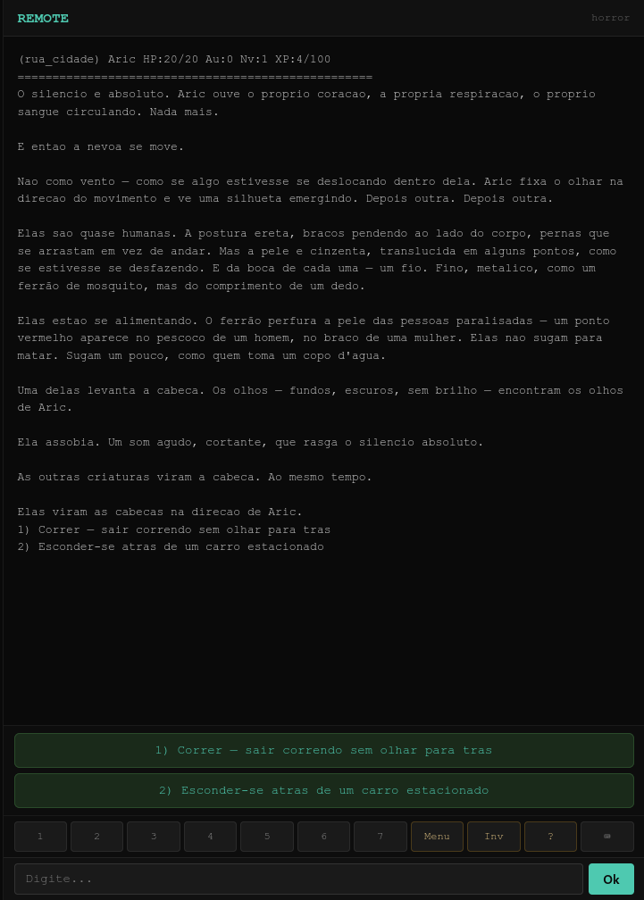

# REMOTE Engine

**A narrative RPG engine for terminal and browser.**

Build multiplayer text adventures with branching stories, tactical 3d6 combat, and persistent worlds — all running on a $10 VPS. No GPU required.

> 🇧🇷 Currently in **Brazilian Portuguese**. Engine interface and all stories are in PT-BR. English version is planned.

```
SSH:  ssh -p 2222 your-server   (terminal native)
Web:  https://your-server:8080   (browser)
```



---

## Features

### Branching Narrative Engine
Pre-generated story trees with zero AI latency. Each node is a piece of narrative followed by numbered choices that branch into different paths. No LLM calls at runtime — every response is instant (<10ms).

### Tactical Combat (GURPS-style 3d6)
- **7 hit locations** — Torso, Head (-5), Vitals (-3), Arms (-2), Legs (-2)
- **Damage multipliers** — Head x2, Vitals x3
- **Critical hits** (≤4) — automatic hit + bonus damage
- **Fumbles** (≥17) — catastrophic failures
- **Dynamic initiative** — re-rolled each turn based on HP and skill
- **Weapon from inventory** — fists, knives, swords, each with different damage dice

### Dual Interface
- **SSH** — native terminal experience for purists
- **Web** — same backend, same gameplay, accessible from any browser
- **Responsive** — works on mobile and desktop

### Persistent World
- SQLite database — player progress, inventory, history
- Save/Load — pick up exactly where you left off
- Conditions — choices that depend on items, stats, flags, or level
- Effects — every node can grant or drain HP, gold, XP, items, flags

### Self-Hosted
- Single binary, no dependencies
- **~10MB RAM** per active player
- Deploy on any Linux VPS with Go 1.25+
- systemd service included

---

## Quick Start

```bash
# Clone
git clone https://github.com/yourusername/remote-engine.git
cd remote-engine/engine-core

# Build
cd server && go build -o remote-server ./cmd/server

# Run
export DB_PATH="../data/game.db"
export STATIC_DIR="../web/static"
./remote-server

# Create a test account
curl -X POST http://localhost:8080/api/register \
  -H "Content-Type: application/json" \
  -d '{"username":"teste","password":"123","char_name":"Aric"}'

# Login and play
# Web: http://localhost:8080/play
# SSH: ssh -p 2222 teste@localhost (password: 123)
```

---

## Architecture

```
                    ┌──────────────────────┐
                    │   Player (SSH/Web)    │
                    └──────────┬───────────┘
                               │
                    ┌──────────▼───────────┐
                    │     HTTP Handler     │
                    │     SSH Handler      │
                    └──────────┬───────────┘
                               │
                    ┌──────────▼───────────┐
                    │   Engine.Process()   │
                    │   ┌───────────────┐  │
                    │   │  Combat 3d6   │  │
                    │   │  Commands     │  │
                    │   │  Inventory    │  │
                    │   │  Menu/Travel  │  │
                    │   └───────────────┘  │
                    └──────────┬───────────┘
                               │
                    ┌──────────▼───────────┐
                    │   SQLite Database    │
                    │   nodes / choices    │
                    │   players / arcs     │
                    └──────────────────────┘
```

### Data flow
1. Player sends input (choice number or text command)
2. Handler receives it, strips ANSI for web, passes raw for SSH
3. `Engine.ProcessInput()` parses and routes to the correct handler
4. Engine loads nodes from SQLite, applies conditions, computes combat
5. `CommandResult{Output, NeedsRedraw, Continue}` is returned
6. Handler responds — JSON for web, raw text for SSH

---

## Deploy to VPS

```bash
# One-line install on a fresh VPS:
sudo ./scripts/install.sh

# Or deploy from your machine:
./scripts/deploy.sh user@your-vps-ip
```

Both scripts compile, install as a systemd service, and start automatically on port 8080 (HTTP) and 2222 (SSH).

### Requirements
- **Server**: 1 vCPU, 512MB RAM, 1GB disk — ~$5-10/month
- **Go 1.25+** (installed automatically by install.sh)
- **Linux** amd64 (any distro)

---

## API

| Method | Endpoint | Description | Body |
|--------|----------|-------------|------|
| POST | `/api/register` | Create an account | `{username, password, char_name?}` |
| POST | `/api/login` | Login | `{username, password}` → returns `token` |
| POST | `/api/command` | Send action | `{token, input}` → `{output, redraw, continue}` |
| GET | `/api/story-graph?world=` | Graph data for editor | — |
| GET | `/api/export` | Export player save | `?token=` |

---

## Story Format

Stories are JSON arrays of **nodes**. Each node has:

```json
{
  "id": "forest_001",
  "sala_id": "dark_forest",
  "tipo": "historia",
  "texto": "You stand at the edge of an ancient forest...",
  "tags": ["forest", "intro"],
  "xp": 10,
  "efeito": "gold:+10,item:torch",
  "escolhas": [
    {"texto": "Enter the forest", "node_destino": "forest_002", "ordem": 1},
    {"texto": "Follow the road", "node_destino": "forest_003", "ordem": 2}
  ]
}
```

Combat nodes:
```json
{
  "id": "wolf_combat",
  "sala_id": "dark_forest",
  "tipo": "combate",
  "tags": ["wolf", "combate", "vitoria:wolf_victory", "derrota:wolf_defeat"],
  "escolhas": []
}
```

---

## License

GNU General Public License v3.0 (GPL-3.0)

This program is free software: you can redistribute it and/or modify it under the terms of the GNU General Public License as published by the Free Software Foundation, either version 3 of the License, or (at your option) any later version.

See the [LICENSE](LICENSE) file for details.
